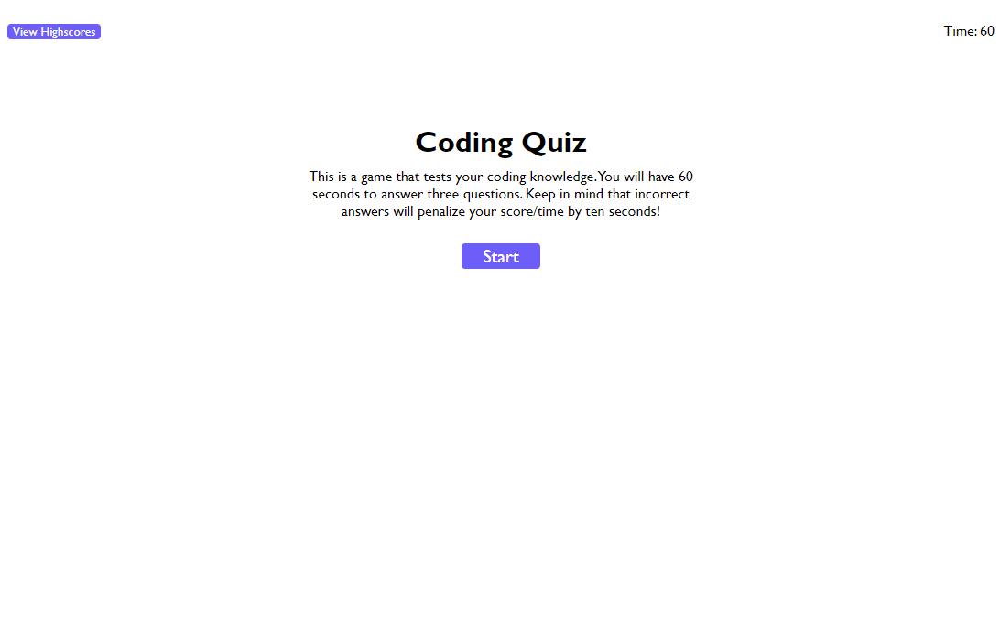

# Coding Quiz

## Description
This quiz asks three questions pertaining to coding. Each incorrect answer deducts ten seconds from your time/score. When the timer reaches 0, or you answer all of the questions, your csore is logged and you are asked to input your initials. There is a highscore screen that can be cleared. 

## Link to Deployed Application

https://iamtrai.github.io/coding-quiz/